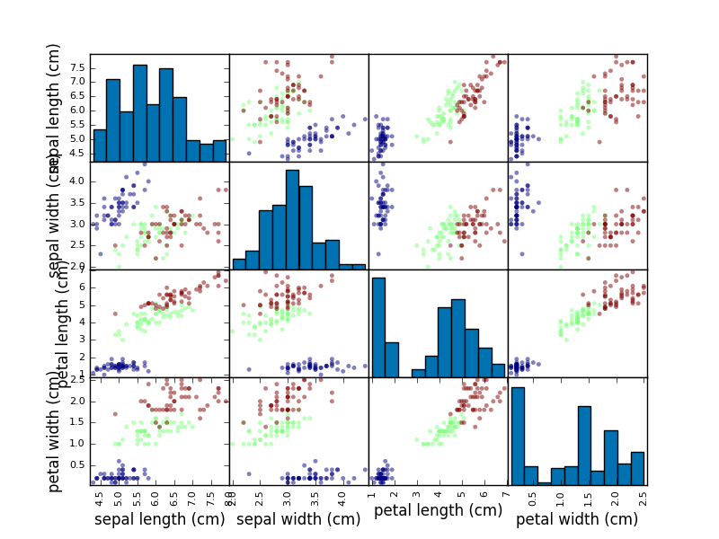
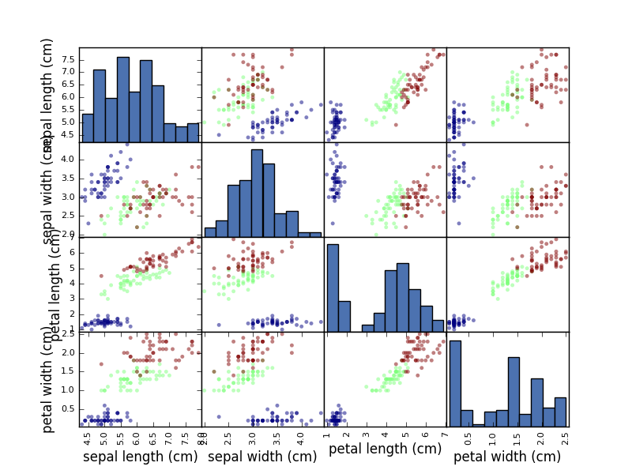

# No More Blue

[](http://snyk.io/test/github/mramshaw/No_More_Blue?style=plastic&targetFile=requirements.txt)

Liven up your `matplotlib` scatter maps

## Motivation

Muted blues have been the ___go to___ corporate colour for ages (think IBM or Microsoft)
but are less than ideal for visualizing multivariate relationships. Here we cycle through
all of the available `matplotlib` colour schemes, allowing you to choose a pleasing one.

[There may well be ___more___ colour schemes available - but not yet installed.]

Of course there is also [seaborn](http://seaborn.pydata.org/) - but that may be overkill
for many use cases. Even so, we will install it so its colour schemes are available.

## Prerequisites

Python and `pip` obviously.

Install the rest as follows:

    $ pip install --user -r requirements.txt

[Replace with `pip3` for Python 3.]

## Data

We will use the well-known [Iris](http://archive.ics.uci.edu/ml/datasets/Iris) dataset.

## Use

Run `plot_style.py` by typing <kbd>python plot_style.py</kbd>.

Close the displayed graphs if they do not conform to your aesthetics.

Once you find a style you like, make a note of the final displayed style:

```bash
$ python plot_style.py 
seaborn-darkgrid
seaborn-notebook
classic
seaborn-ticks
grayscale
bmh
seaborn-talk
dark_background
ggplot
fivethirtyeight
_classic_test
seaborn-colorblind
^C$ 
```

In the example shown above, this would be `seaborn-colorblind`.

[You can continue through the rest of the available styles - perhaps you
 may find a style that is even more pleasing - or else type <kbd>Ctrl-C</kbd>
 to terminate.]

## Examples

The following are some examples of colour styles:

#### Classic


[Probably a good default choice for most uses, although I think the green is hard to read.]

#### Seaborn Colorblind



[Probably a better default choice for most uses, although I the green is still hard to read.]

#### Seaborn Deep



[A nice variationon the Colorblind scheme.]

## Reference

Matplotlib style gallery:

    http://matplotlib.org/gallery.html#style_sheets

Seaborn:

    http://seaborn.pydata.org/tutorial.html

## Credits

Inspired by one of the answers to this StackOverflow question:

    https://stackoverflow.com/questions/46383645/seaborn-and-pd-scatter-matrix-plot-color-issues
